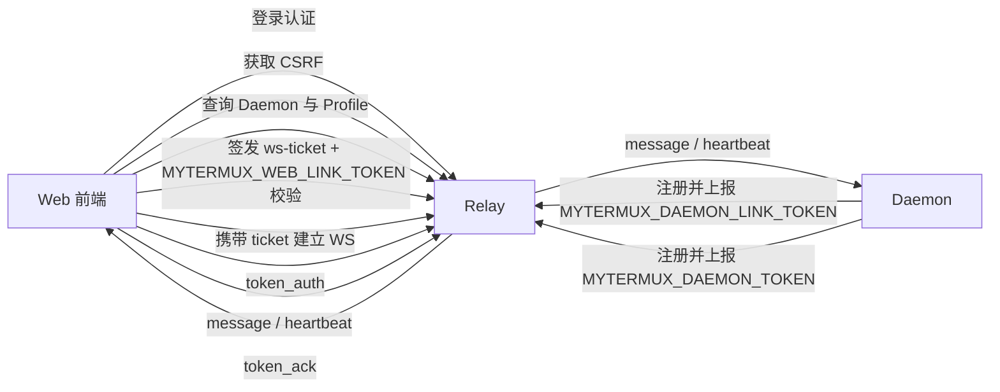
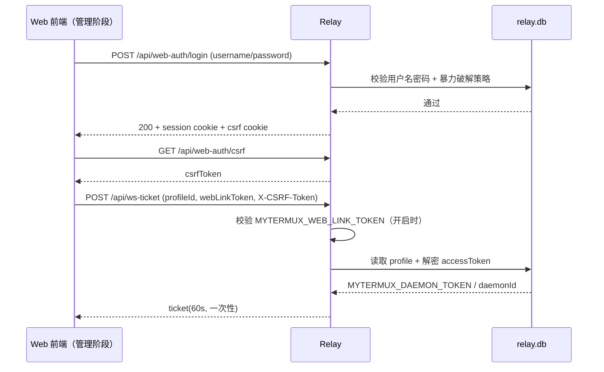
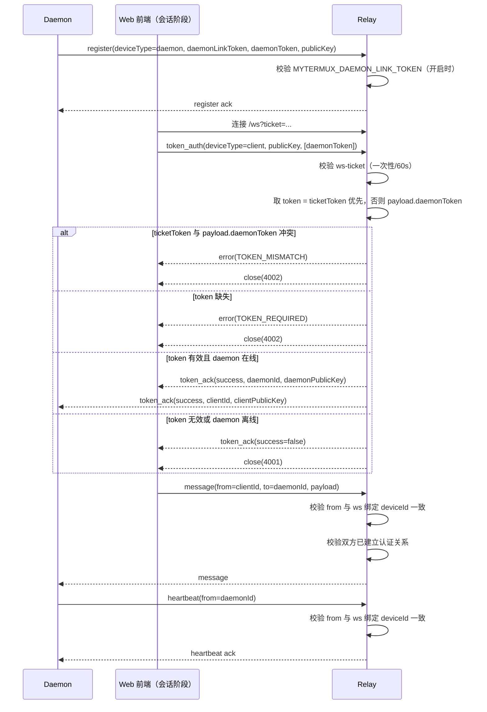

# MyTermux 服务协议流转图

本文聚焦 Relay / Web / Daemon 的关键协议链路，便于排查认证与路由问题。
说明：`Web 管理端` 与 `Web Client` 在实现上是同一个 Web 前端，这里仅按阶段区分职责。
部署约束：本地/测试统一无证书（HTTP + WS）；生产必须走 Nginx 反向代理并启用证书（HTTPS + WSS）。
默认地址：Web Client `127.0.0.1:62100`，Relay `127.0.0.1:62200`，Daemon 本地状态监听 `127.0.0.1:62300`。

## 1. 总体链路（HTTP + WebSocket）

## 2. Web 登录与 ws-ticket 签发

## 3. WebSocket 注册、Token 认证与消息转发

## 4. 关键约束（排障优先看）

- Client 连接 `/ws` 前必须先拿 `ws-ticket`，ticket 仅可消费一次，默认 60 秒过期；可配置 `MYTERMUX_WEB_LINK_TOKEN` 二次校验。
- `token_auth` 仅允许 `deviceType=client`。
- 若 ticket 中已有 token，且 payload 另传 token 且不一致，会被拒绝（`TOKEN_MISMATCH`）。
- 可配置 `MYTERMUX_DAEMON_LINK_TOKEN` 强制 daemon 链路授权。
- `message/heartbeat` 的 `from` 必须与该 ws 已绑定 `deviceId` 一致，否则会被拒绝并断开连接。
- 只有通过 `MYTERMUX_DAEMON_TOKEN` 认证建立关系的 daemon/client 才允许消息路由。
