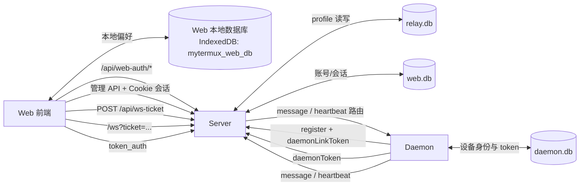
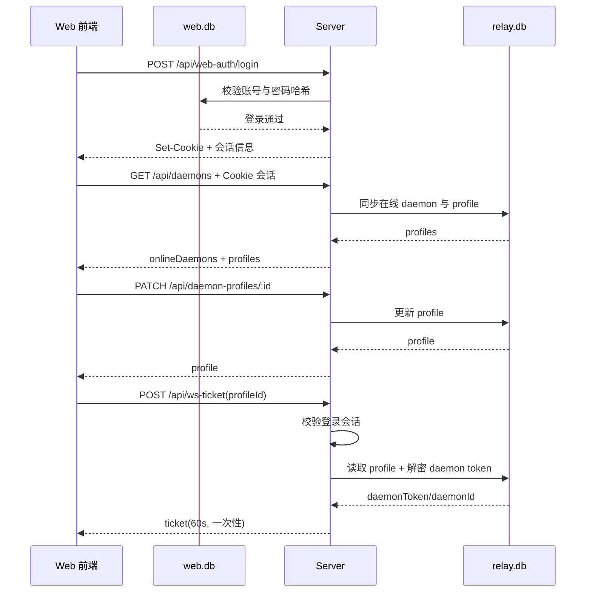

# MyTermux 服务协议流转图

本文聚焦 Server / Web / Daemon 的关键协议链路，便于排查认证与路由问题。  
部署约束：本地/测试统一无证书（HTTP + WS）；生产必须走 Nginx 反向代理并启用证书（HTTPS + WSS）。  
默认地址：Web + Server `127.0.0.1:62200`，Daemon 本地状态监听 `127.0.0.1:62300`。

## 1. 总体链路（HTTP + WebSocket）

## 2. Web 登录 + Server 管理 API

## 3. WebSocket 注册、Token 认证与消息转发

## 4. 关键约束（排障优先看）

- Web 登录通过 `/api/web-auth/*`，账号与会话写入 `web.db`（不写浏览器本地账号）。
- 管理 API 与 ws-ticket 必须依赖有效 Web 登录会话。
- Client 连接 `/ws` 前必须先拿 `ws-ticket`，ticket 仅可消费一次，默认 60 秒过期。
- `token_auth` 仅允许 `deviceType=client`。
- `message/heartbeat` 的 `from` 必须与 ws 绑定 `deviceId` 一致，否则会被拒绝并断开。
- 只有通过 `MYTERMUX_DAEMON_TOKEN` 认证建立关系的 daemon/client 才允许消息路由。
